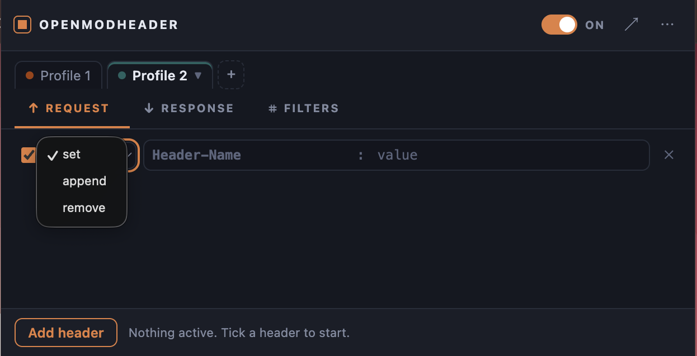
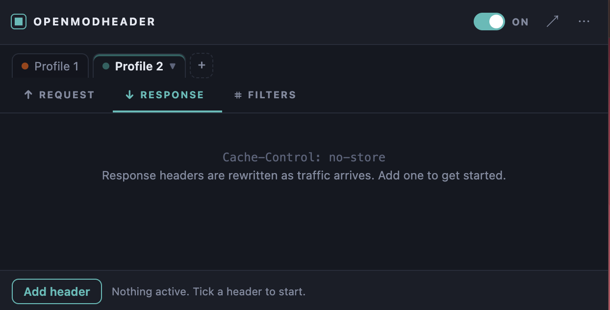
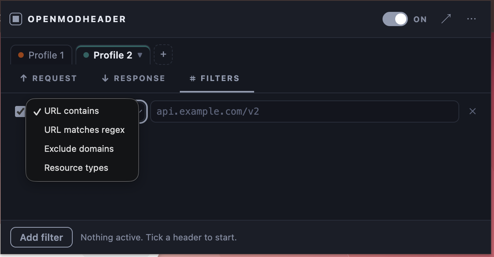
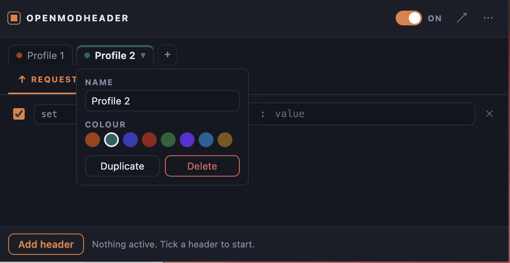

# OpenModHeader

Add, rewrite, and remove HTTP request and response headers from your browser toolbar. Group rules into profiles, scope them to the URLs you care about, and flip the whole thing off with one keystroke.

Built on Manifest V3 for both Chrome and Firefox. No account, no telemetry, no network calls — everything stays on your machine.

---

## Screenshots

| | |
|---|---|
| <br>**Request headers** — pick `set`, `append`, or `remove` per row; each row reads like the line it sends. | <br>**Response headers** — the same editor for headers rewritten as traffic arrives. |
| <br>**Filters** — scope a profile by URL substring, regex, excluded domains, or resource type. | <br>**Profiles** — rename, recolour, duplicate, or delete from the tab that's already open. |

---

## Features

**Header editing**
- Set, append, or remove headers on both requests and responses
- Enable or disable any single header without deleting it
- Live count of active headers on the toolbar badge

**Profiles**
- Unlimited independent header sets, each with its own name and colour
- All enabled profiles apply at once, so you can layer an auth-token profile over a feature-flag profile
- Duplicate, rename, recolour, and delete from the profile menu

**URL filtering**
- `URL contains` — plain substring match
- `URL matches regex` — full regular expression
- `Exclude domains` — skip named domains and their subdomains
- `Resource types` — restrict to `xmlhttprequest`, `main_frame`, `script`, and so on
- Leave filters empty and the profile applies everywhere

**Everything else**
- Global on/off switch, plus `Alt+Shift+H` from anywhere
- Export and import profiles as JSON to share a setup or check it into a repo
- Open the popup in a full browser tab when you're editing a lot at once
- Follows your system light/dark theme
- Warns you before saving a rule the browser will reject

---

## Install

### Requirements

| Browser | Minimum version | Why |
|---|---|---|
| Chrome, Edge, Brave, Vivaldi, Opera | **111** | CSS `color-mix()` in the interface |
| Firefox | **113** | Same; the packaged build declares 115 (the ESR baseline) |

### Chrome

The extension isn't on the Chrome Web Store, so it loads unpacked:

1. Download and unzip the release. Put the folder somewhere permanent — Chrome reads it from disk at every startup, so don't leave it in Downloads.
2. Open `chrome://extensions`.
3. Turn on **Developer mode** using the toggle in the top right.
4. Click **Load unpacked** and select the `chrome` folder (the one containing `manifest.json`).
5. Click the puzzle-piece icon in the toolbar and pin OpenModHeader.

Chrome will ask for permission to read and change your data on all websites. Rewriting headers on arbitrary URLs is exactly what that covers. Access is granted at install and stays granted.

> **Note:** Chrome shows a "Disable developer mode extensions" warning on every startup for unpacked extensions. That's expected and can be dismissed.

### Firefox

You'll need the signed `.xpi` file.

1. Download `OpenModHeader_Firefox.xpi` from the latest release.
2. Open `about:addons`.
3. Click the gear icon near the top right and choose **Install Add-on From File…**
4. Select the `.xpi` and confirm with **Add**.

Dragging the `.xpi` onto any Firefox window does the same thing.

**Then grant site access.** Firefox treats site access as something you can revoke at any time, so it may start with none. If so, the popup shows a red bar with a **Grant access** button — click it. To do it by hand, use the extensions button (the puzzle piece) in the toolbar, find OpenModHeader, and choose to always allow it on all sites.

> **If the install is refused:** release and Beta Firefox only accept add-ons signed by Mozilla. An unsigned `.xpi` will be rejected outright. Either get it signed through [addons.mozilla.org](https://addons.mozilla.org/developers/) as an unlisted add-on, or use Developer Edition, Nightly, or ESR with `xpinstall.signatures.required` set to `false` in `about:config`.
>
> **To test without signing at all:** open `about:debugging#/runtime/this-firefox`, click **Load Temporary Add-on**, and pick `manifest.json`. This works on any Firefox, but the add-on disappears when the browser restarts.

---

## Using it

### Headers

The **Request** and **Response** tabs hold the headers themselves. Each row is one header:

| Control | What it does |
|---|---|
| Checkbox | Turns that header off without deleting it |
| `set` | Adds the header, replacing any existing value |
| `append` | Adds another copy alongside the existing value |
| `remove` | Strips the header entirely |
| Name : Value | The header itself, in wire order |

### Filters

The **Filters** tab scopes whichever profile is open. With no filters, that profile applies to every URL.

| Filter | Example |
|---|---|
| URL contains | `api.example.com/v2` |
| URL matches regex | `^https://[a-z]+\.example\.com/` |
| Exclude domains | `ads.com, tracker.io` |
| Resource types | `xmlhttprequest, main_frame` |

Valid resource types: `main_frame`, `sub_frame`, `stylesheet`, `script`, `image`, `font`, `object`, `xmlhttprequest`, `ping`, `csp_report`, `media`, `websocket`, `other`. Firefox additionally accepts `beacon`, `imageset`, `object_subrequest`, `speculative`, `web_manifest`, `xml_dtd`, and `xslt`.

Multiple filters of the same kind are combined with OR — the profile applies if any one of them matches. Comma-separated lists work inside a single row.

### Profiles

Click a profile tab to open it. Click the tab that's already open to get its settings: rename, recolour, duplicate, delete.

Every enabled profile is live at the same time. When two profiles touch the same header, the leftmost one is applied first.

### Shortcuts and export

- `Alt+Shift+H` turns everything off and on without losing your setup
- The badge shows how many headers are live, or `off` when paused
- The **⋯** menu exports and imports profiles as JSON — importing adds to what you have rather than replacing it
- Profile JSON is portable between the Chrome and Firefox builds

---

## Chrome and Firefox behave slightly differently

Chrome removed blocking `webRequest` in Manifest V3, so the Chrome build uses `declarativeNetRequest`. Firefox kept blocking `webRequest`, which is better suited to this job, so the Firefox build uses that. The interface is identical; the engine underneath is not.

| | Chrome | Firefox |
|---|---|---|
| Header name capitalisation | Lowercased by the browser | Kept exactly as you type it |
| `append` on request headers | Only ~20 allowlisted headers | Any header |
| Rule ceiling | 5000 rules, 1000 with regex | No ceiling |
| Site access | Granted at install, permanent | Revocable at any time |

Chrome's `append` allowlist is: `accept`, `accept-encoding`, `accept-language`, `access-control-request-headers`, `cache-control`, `connection`, `content-language`, `cookie`, `forwarded`, `if-match`, `if-none-match`, `keep-alive`, `range`, `te`, `trailer`, `transfer-encoding`, `upgrade`, `user-agent`, `via`, `want-digest`, `x-forwarded-for`. Rows that break this rule get a red outline in the popup — use `set` instead. Response headers can be appended freely on both browsers.

---

## Good to know

- **Already-loaded resources keep their old headers.** New requests pick up changes straight away; reload the page for everything else.
- **Header names are case-insensitive to servers.** Chrome lowercasing them changes nothing functionally — it matches how HTTP/2 and HTTP/3 work on the wire.
- **A few headers can't be modified.** Both browsers reserve some for their own use. On Chrome, the reason appears in the status bar at the bottom of the popup.
- **Profiles are stored locally, not synced.** They stay on the machine you created them on. Use export and import to move them.
- **This is a developer tool.** Setting `Authorization` or `Cookie` headers globally will send your credentials to every site you visit. Scope those profiles with a URL filter.

---

## Privacy

OpenModHeader collects nothing and transmits nothing. It makes no network requests of its own, contains no analytics, and stores your profiles in the browser's local extension storage. The Firefox build declares this formally in its manifest as `data_collection_permissions: { required: ["none"] }`, which is why Firefox shows "does not collect any data" during install.

The permission to read and change data on all websites is what makes header editing possible. It is not used for anything else.

---

## Troubleshooting

**Headers aren't being applied.**
Check the toggle in the popup's title bar isn't off, that the profile's checkbox tabs aren't unticked, and that any URL filter actually matches. Then reload the page — requests already in flight keep their original headers.

**Nothing works on Firefox specifically.**
Almost always missing site access. Open the popup and look for the red bar, or check the extensions button in the toolbar.

**A rule is being rejected on Chrome.**
The status bar at the bottom of the popup names the header and the reason. The usual cause is `append` on a header outside Chrome's allowlist.

**I can't see my response header changes in devtools.**
Firefox's network panel reports what arrived on the wire, not what the extension changed it to. Test against what your page actually receives rather than what devtools displays.

### Inspecting the compiled rules

**Chrome** — click the **service worker** link on the extension's card in `chrome://extensions`, then run:

```js
chrome.declarativeNetRequest.getDynamicRules().then(console.log)
```

**Firefox** — open `about:debugging#/runtime/this-firefox` and click **Inspect** on OpenModHeader.

---

## Project layout

```
chrome/     load this folder in Chrome and other Chromium browsers
firefox/    source for the Firefox build; package as .xpi
```

`common.js`, `popup.html`, `popup.css`, and `popup.js` are byte-identical between the two. Only `manifest.json` and `background.js` differ.

| File | Role |
|---|---|
| `manifest.json` | Permissions, background entry point, popup, keyboard shortcut |
| `common.js` | State model, JSON normalisation, shared constants |
| `background.js` | The engine — `declarativeNetRequest` on Chrome, `webRequest` on Firefox |
| `popup.html` / `popup.css` / `popup.js` | The interface |
| `icons/` | Toolbar icons |

---