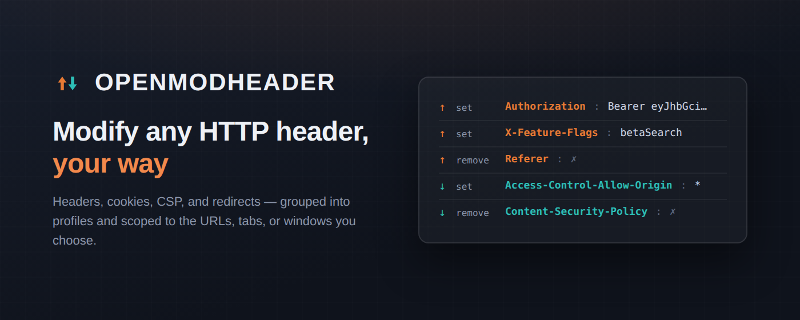
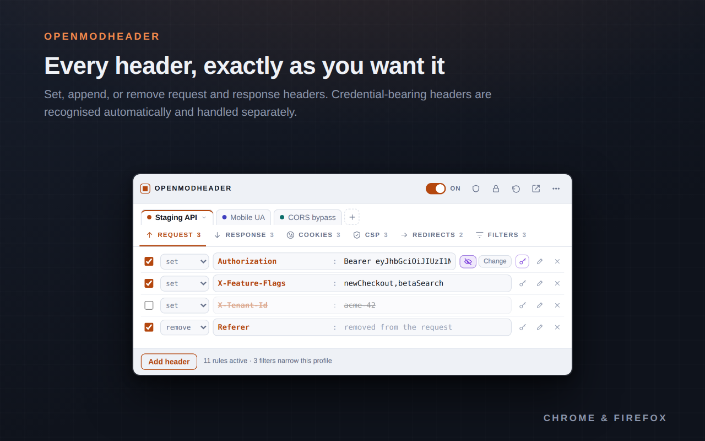
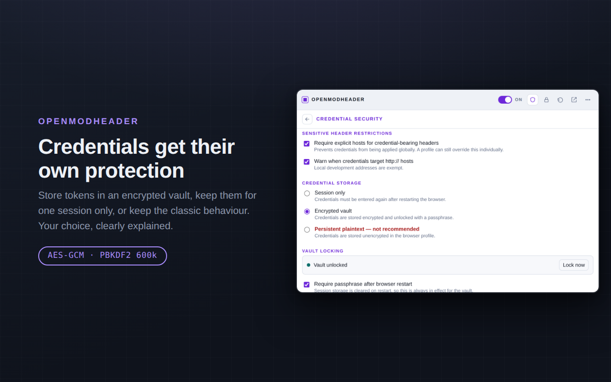
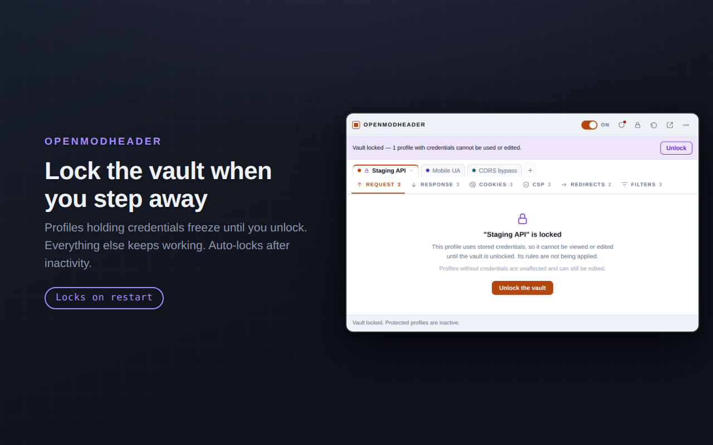
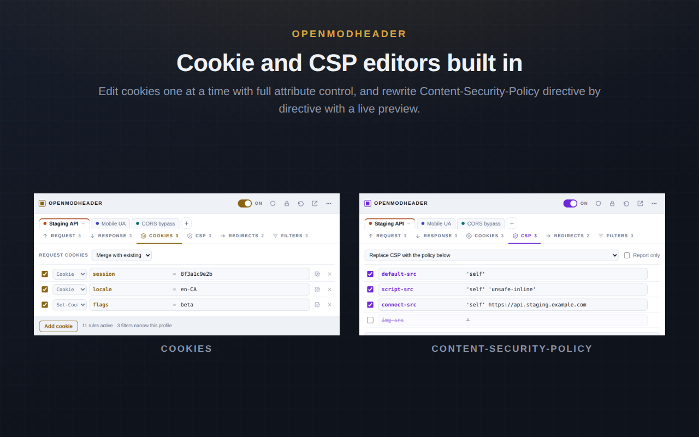
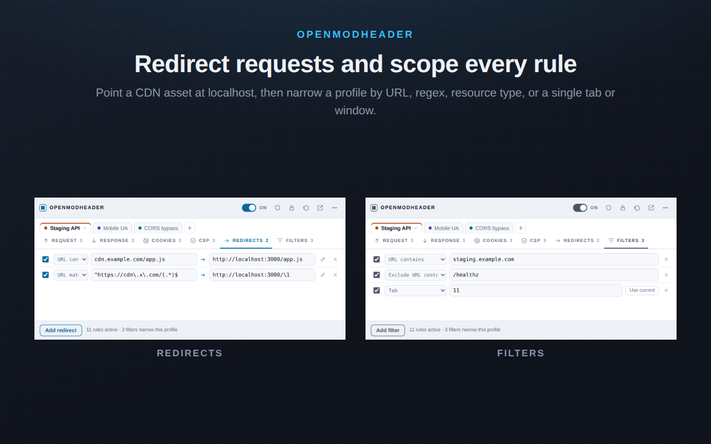

# OpenModHeader

Add, rewrite, and remove HTTP request and response headers from your browser toolbar. Group rules into profiles, scope them to the URLs you care about, and flip the whole thing off with one keystroke.

Headers and cookies that carry credentials — `Authorization`, API keys, session cookies — are recognised on sight and handled apart from the rest of your configuration: encrypted behind a passphrase, or held in memory for a single session. See [Credential security](#credential-security).

Built on Manifest V3 for both Chromium and Firefox. No account, no telemetry, no network calls — everything stays on your machine.

---

## Features

**Header editing**
- Set, append, or remove headers on both requests and responses
- Enable or disable any single header without deleting it
- Attach a comment to any row as a note to yourself
- Autocomplete for common request and response header names
- Live count of active rules on the toolbar badge



**Credential security**
- `Authorization`, `Cookie`, API keys and common vendor variants are recognised as credentials automatically — and the shield button on any row marks a header or cookie no list would guess
- Session cookies, tokens and CSRF values from the Cookie editor go through the identical treatment; a `locale` cookie doesn't
- Three storage modes: memory-only for the session (default), an encrypted vault behind a passphrase, or the original persistent plaintext if you need it
- Credential headers and cookies stay inactive until their profile has a real URL or host filter, so a token can't be broadcast to every site you visit
- A warning when a credential profile targets a plain `http://` host
- Lock from the title bar or let it auto-lock — locking freezes only the profiles holding credentials
- Exports and clipboard copies omit credentials unless you ask otherwise





**Cookie editor**
- Edit individual cookies instead of hand-writing the whole `Cookie` header
- Request cookies merge with what the browser already sends, or replace it entirely
- Response cookies become `Set-Cookie` with full attribute control: Path, Domain, Max-Age, SameSite, Secure, HttpOnly
- Session and token cookies are treated as credentials, exactly like a credential header — see [Credential security](#credential-security)

**Content-Security-Policy editor**
- Leave CSP alone, strip it entirely, or replace it with a policy you compose
- Build the policy one directive at a time with autocomplete for standard directive names
- Live preview of the exact header that will be sent
- Toggle between enforcing and `Report-Only`



**Profiles**
- Unlimited independent header sets, each with its own name and colour
- All enabled profiles apply at once, so you can layer an auth-token profile over a feature-flag profile
- Duplicate, rename, recolour, and delete from the profile menu

**Redirects**
- Send matching requests somewhere else — handy for pointing a CDN asset at localhost
- Match by substring or regex, with `\\1` capture-group substitution in the target

**Filtering**
- `URL contains` — plain substring match
- `URL matches regex` — full regular expression
- `Exclude URL containing` / `Exclude URL regex` — carve exceptions out of a match
- `Exclude domains` — skip named domains and their subdomains
- `Resource types` — restrict to `xmlhttprequest`, `main_frame`, `script`, and so on
- `Tab` / `Window` — scope a profile to one tab or window, with a **Use current** button that fills in the id for you
- Leave filters empty and the profile applies everywhere



**Everything else**
- Global on/off switch, plus `Alt+Shift+H` from anywhere
- Undo with `Ctrl+Z` (or the toolbar arrow) — 40 steps of history
- Profile search once you have more than five profiles
- Export and import profiles as JSON to share a setup or check it into a repo
- Open the popup in a full browser tab when you're editing a lot at once
- Follows your system light/dark theme
- Warns you before saving a rule the browser will reject

---

## Install From Source

### Requirements

| Browser | Minimum version | Why |
|---|---|---|
| Chrome, Edge, Brave, Vivaldi, Opera | **111** | CSS `color-mix()` in the interface |
| Firefox | **113** | Same; the packaged build declares 115 (the ESR baseline) |

### Chromium (Chrome, Edge, Brave, Vivaldi, Opera)

The extension loads unpacked:

1. Download and unzip the release. Put the folder somewhere permanent — the browser reads it from disk at every startup, so don't leave it in Downloads.
2. Open `chrome://extensions` (`edge://extensions` on Edge, `brave://extensions` on Brave, and so on).
3. Turn on **Developer mode** using the toggle in the top right.
4. Click **Load unpacked** and select the `chromium` folder (the one containing `manifest.json`).
5. Click the puzzle-piece icon in the toolbar and pin OpenModHeader.

The browser will ask for permission to read and change your data on all websites. Rewriting headers on arbitrary URLs is exactly what that covers. Access is granted at install and stays granted.

> **Note:** Chromium browsers show a "Disable developer mode extensions" warning on every startup for unpacked extensions. That's expected and can be dismissed.

### Firefox

You'll need the signed `.xpi` file.

1. Download `OpenModHeader_Firefox.xpi` from the latest release.
2. Open `about:addons`.
3. Click the gear icon near the top right and choose **Install Add-on From File…**
4. Select the `.xpi` and confirm with **Add**.

Dragging the `.xpi` onto any Firefox window does the same thing.

**Then grant site access.** Firefox treats site access as something you can revoke at any time, so it may start with none. If so, the popup shows a red bar with a **Grant access** button — click it. To do it by hand, use the extensions button (the puzzle piece) in the toolbar, find OpenModHeader, and choose to always allow it on all sites.

> **If the install is refused:** release and Beta Firefox only accept add-ons signed by Mozilla. An unsigned `.xpi` will be rejected outright. Either get it signed through [addons.mozilla.org](https://addons.mozilla.org/developers/) as an unlisted add-on, or use Developer Edition, Nightly, or ESR with `xpinstall.signatures.required` set to `false` in `about:config`.
>
> **To test without signing at all:** open `about:debugging#/runtime/this-firefox`, click **Load Temporary Add-on**, and pick `manifest.json`. This works on any Firefox, but the add-on disappears when the browser restarts.

---

## Using it

### Headers

The **Request** and **Response** tabs hold the headers themselves. Each row is one header:

| Control | What it does |
|---|---|
| Checkbox | Turns that header off without deleting it |
| `set` | Adds the header, replacing any existing value |
| `append` | Adds another copy alongside the existing value |
| `remove` | Strips the header entirely |
| Name : Value | The header itself, in wire order |

### Filters

The **Filters** tab scopes whichever profile is open. With no filters, that profile applies to every URL.

| Filter | Example |
|---|---|
| URL contains | `api.example.com/v2` |
| URL matches regex | `^https://[a-z]+\.example\.com/` |
| Exclude domains | `ads.com, tracker.io` |
| Resource types | `xmlhttprequest, main_frame` |

Valid resource types: `main_frame`, `sub_frame`, `stylesheet`, `script`, `image`, `font`, `object`, `xmlhttprequest`, `ping`, `csp_report`, `media`, `websocket`, `other`. Firefox additionally accepts `beacon`, `imageset`, `object_subrequest`, `speculative`, `web_manifest`, `xml_dtd`, and `xslt`.

Multiple filters of the same kind are combined with OR — the profile applies if any one of them matches. Comma-separated lists work inside a single row.

### Profiles

Click a profile tab to open it. Click the tab that's already open to get its settings: rename, recolour, duplicate, delete.

Every enabled profile is live at the same time. When two profiles touch the same header, the leftmost one is applied first.

### Shortcuts and export

- `Alt+Shift+H` turns everything off and on without losing your setup
- The badge shows how many headers are live, or `off` when paused
- The **⋯** menu exports and imports profiles as JSON — importing adds to what you have rather than replacing it
- Profile JSON is portable between the Chromium and Firefox builds

---

## Credential security

Some headers carry credentials. `Authorization`, `Proxy-Authorization`, `Cookie`, `Set-Cookie`, `X-API-Key`, `X-Auth-Token` and vendor variants like `X-Acme-Api-Key` are recognised case-insensitively. Any other header can be marked as a credential with the shield button on its row — no built-in list covers every vendor's naming.

**Cookies get exactly the same treatment**, because a session cookie is as much a credential as a bearer token. `session`, `sessionid`, `sid`, `token`, `access_token`, `refresh_token`, `jwt`, `csrf`, `jsessionid`, `phpsessid` and similar names are recognised, along with patterns catching anything ending in `_token`, `_auth`, `_secret` or `_key`. A recognised cookie's value moves into the secret store, where it is encrypted in vault mode, cleared on lock, revealed with the eye button, and omitted from exports — all identically to a credential header, and gated by the same host requirement below. Ordinary cookies like `locale` or `theme` keep their value inline and aren't gated, since forcing a passphrase on a language preference would be noise. The shield button covers anything the list doesn't recognise.

**A credential needs a host.** A rule with no URL filter applies to every request your browser makes. Harmless for `X-Debug: 1`; for `Authorization: Bearer …` or a session cookie it means your credential goes to every site you visit, any of which can log it and replay it. So a credential-bearing header or cookie stays inactive until its profile has a meaningful URL or host filter — a bare `*`, `<all_urls>` or `^.*$` restricts nothing and doesn't count. If you genuinely need one everywhere, you can override it for that one profile without weakening the others. You're also warned when a credential profile targets a plain `http://` host, with `localhost`, `127.0.0.1`, `[::1]` and `*.local` exempt.

**Three storage modes**, chosen in the Security panel:

| Mode | Where the value lives | After a browser restart |
|---|---|---|
| **Session only** *(default)* | `storage.session` — memory, never written to disk | Gone. Profiles are preserved and marked as needing a credential |
| **Encrypted vault** | AES-GCM ciphertext in local storage; key derived from your passphrase with PBKDF2, 600,000 SHA-256 iterations | Locked until you enter the passphrase |
| **Persistent plaintext** | Unencrypted in the browser profile directory | Still active |

Persistent plaintext is the extension's original behaviour, kept for people who need it and gated behind an explicit confirmation. Anything that can read your browser profile directory can read those values, and they stay readable after the browser closes.

**Locking freezes credentials, not the extension.** Lock from the title bar, from the Security panel, or let auto-lock do it. A locked vault stops applying rules from any profile that holds credentials and shows an unlock panel in place of its rows; nothing is deleted. Profiles without credentials keep applying and stay fully editable. The auto-lock timer measures time since your last deliberate credential action — unlocking, editing, revealing, exporting — and deliberately ignores network activity, so a background tab polling an API won't hold the vault open.

**Exports and copies leave credentials out by default.** A configuration-only export carries profiles, filters and redirects with each credential replaced by `"value": null, "requiresCredential": true`; it imports cleanly and stays locked until you supply the values. An encrypted backup is available in vault mode and asks for your passphrase again even when unlocked. A plaintext export exists, is warned about, and is never the default. Imports never activate plaintext credentials silently, and an imported profile doesn't inherit permission to send credentials globally.

### What this doesn't protect against

The vault protects credentials **at rest**: someone who copies your browser profile off disk, restores it from a backup, or reads a synced copy can't recover them without the passphrase. It does not protect against malware running as your user account, a malicious extension, or a hostile server you've legitimately scoped a profile to. While the vault is unlocked the derived key is cached in session storage, and anything that can run code in the extension's context can use it — lock the vault when you step away from the machine. A passphrase you can remember is also one that can be guessed given the ciphertext; PBKDF2 makes that expensive rather than impossible, so use a long one.

There is no passphrase recovery, by design. **Security → Reset vault** permanently deletes every encrypted credential and keeps your profiles, filters, redirects and non-sensitive headers.

[SECURITY.md](SECURITY.md) covers all of this in full, including the per-browser differences and the migration path for profiles created before this feature existed.

---

## Chromium and Firefox behave slightly differently

Chromium removed blocking `webRequest` in Manifest V3, so the Chromium build uses `declarativeNetRequest`. Firefox kept blocking `webRequest`, which is better suited to this job, so the Firefox build uses that. The interface is identical; the engine underneath is not.

| | Chromium | Firefox |
|---|---|---|
| Header name capitalisation | Lowercased by the browser | Kept exactly as you type it |
| `append` on request headers | Only ~20 allowlisted headers | Any header |
| Request cookie **merge** | Appended — a duplicate name is sent twice | True merge, same name overwritten |
| **Exclude URL** filters | Suppress every profile's rules for that request | Scoped to the profile that defines them |
| Rule ceiling | 5000 rules, 1000 with regex | No ceiling |
| Site access | Granted at install, permanent | Revocable at any time |
| When a credential is locked or missing | The whole rule containing it is withheld | Only that header operation is skipped |

Both differences come from the same root cause: Chromium's `declarativeNetRequest` cannot read a request before deciding what to do with it, while Firefox's `webRequest` can. If a duplicate cookie matters to you on Chromium, use **Replace all cookies** instead of merge.

Tab and window filters work on both, but on Chromium they compile to session rules — `tabIds` is only supported there — which means a tab-scoped profile is rebuilt from scratch when the browser restarts. Tab ids don't survive a restart either, so re-capture them with **Use current**.

Chromium's `append` allowlist is: `accept`, `accept-encoding`, `accept-language`, `access-control-request-headers`, `cache-control`, `connection`, `content-language`, `cookie`, `forwarded`, `if-match`, `if-none-match`, `keep-alive`, `range`, `te`, `trailer`, `transfer-encoding`, `upgrade`, `user-agent`, `via`, `want-digest`, `x-forwarded-for`. Rows that break this rule get a red outline in the popup — use `set` instead. Response headers can be appended freely on both browsers.

---

## Good to know

- **Already-loaded resources keep their old headers.** New requests pick up changes straight away; reload the page for everything else.
- **Header names are case-insensitive to servers.** Chromium lowercasing them changes nothing functionally — it matches how HTTP/2 and HTTP/3 work on the wire.
- **A few headers can't be modified.** Both browsers reserve some for their own use. On Chromium, the reason appears in the status bar at the bottom of the popup.
- **Profiles are stored locally, not synced.** They stay on the machine you created them on. Use export and import to move them.
- **This is a developer tool.** Credential headers and cookies are held back until their profile has a real URL filter, but that guard is only as good as the filter you write. Scope a credential profile to the host that issued the token, not to a pattern that happens to include it.
- **A locked vault only affects profiles that hold credentials.** Everything else keeps applying and stays editable, so locking isn't a way to turn the extension off — the toggle and `Alt+Shift+H` are.
- **Removing CSP weakens the page you're testing.** It's the right tool for debugging a policy that blocks your tooling, but scope it to the site you're working on rather than leaving it on everywhere.
- **Redirects apply before headers.** A request that gets redirected is matched again at its new URL, so a profile filtered on the old host won't touch the redirected request.

---

## Privacy

OpenModHeader collects nothing and transmits nothing. It makes no network requests of its own, contains no analytics, and stores your profiles in the browser's local extension storage. The Firefox build declares this formally in its manifest as `data_collection_permissions: { required: ["none"] }`, which is why Firefox shows "does not collect any data" during install.

The permission to read and change data on all websites is what makes header editing possible. It is not used for anything else.

Credentials never leave your machine either. Encryption is done with the browser's own Web Crypto, there is no key escrow and no recovery service, and no passphrase or derived key is ever written to disk.

---

## Troubleshooting

**Headers aren't being applied.**
Check the toggle in the popup's title bar isn't off, that the profile's checkbox tabs aren't unticked, and that any URL filter actually matches. Then reload the page — requests already in flight keep their original headers.

**A profile shows a padlock and its rules aren't applying.**
It holds credentials and the vault is locked. Click **Unlock** in the bar at the top of the popup. In session-only mode there's no vault to unlock — the credential was cleared when the browser session ended, so re-enter it on the header row.

**A credential header or cookie is being ignored even though the profile is enabled.**
Credential-bearing headers and cookies need a meaningful URL or host filter before they activate, and `*` or `<all_urls>` doesn't count. Add a real filter on the Filters tab, or override the requirement for that profile in the Security panel.

**Nothing works on Firefox specifically.**
Almost always missing site access. Open the popup and look for the red bar, or check the extensions button in the toolbar.

**A rule is being rejected on Chromium.**
The status bar at the bottom of the popup names the header and the reason. The usual cause is `append` on a header outside Chromium's allowlist.

**I can't see my response header changes in devtools.**
Firefox's network panel reports what arrived on the wire, not what the extension changed it to. Test against what your page actually receives rather than what devtools displays.

### Inspecting the compiled rules

**Chromium** — click the **service worker** link on the extension's card in `chrome://extensions`, then run:

```js
chrome.declarativeNetRequest.getDynamicRules().then(console.log)
```

**Firefox** — open `about:debugging#/runtime/this-firefox` and click **Inspect** on OpenModHeader.

---

## Project layout

```
chromium/   load this folder in Chrome, Edge, Brave, and other Chromium browsers
firefox/    source for the Firefox build; package as .xpi
```

Every file is byte-identical between the two builds except `manifest.json` and `background.js`. The security code in particular is shared verbatim, so the two browsers cannot disagree about whether a profile is allowed to activate.

| File | Role |
|---|---|
| `manifest.json` | Permissions, background entry point, popup, keyboard shortcut |
| `common.js` | State model, JSON normalisation, shared constants |
| `common-api.js` | Browser API shim — `browser.*` on Firefox, `chrome.*` on Chromium |
| `background.js` | The engine — `declarativeNetRequest` on Chromium, `webRequest` on Firefox |
| `security.js` | Credential policy: sensitive header and cookie recognition, host rules, activation gate. Pure functions, no storage or crypto |
| `vault.js` | AES-GCM encryption and PBKDF2 key derivation over Web Crypto |
| `secretstore.js` | Credential storage across the three modes, plus vault lock state |
| `popup.html` / `popup.css` / `popup.js` | The interface |
| `popup-security.js` | Security panel, unlock flow, and every credential prompt |
| `icons.js` | Inline SVG icons for the interface |
| `icons/` | Toolbar icons |
| `SECURITY.md` | Credential-handling reference, shipped with each build |

---